# Vector-Quantized Variational Autoencoder (VQ-VAE) for HipMRI Prostate Cancer Radiotherapy Reconstruction

## Description

This repository contains a **Vector-Quantized Variational Autoencoder (VQ-VAE)** that uses the CSIRO HipMRI dataset to reconstruct the 2D pelvic MRI slices. This model generates acceptable medical research reconstructions by learning discrete latent representations with an embedding codebook. The reconstructions are realistic and interpretable as well. The quality of the reconstructions is measured using the Structural Similarity Index (SSIM) in which a score above 0.6 is being considered clinically acceptable..

---

## VQ-VAE Description

A **Vector-Quantized Variational Autoencoder (VQ-VAE)** is a VAE which incorporates vector quantization into the model by replacing the continuous latent space with a discrete codebook of learned embeddings. Each latent vector is quantised to its nearest codebook entry to produce concise and understandable representations that aid quality reconstruction whilst significantly increasing the stability, which is particularly valuable in medical imaging where structural fidelity and anatomical consistency are crucial.

---

## Implementation Overview

### Architecture

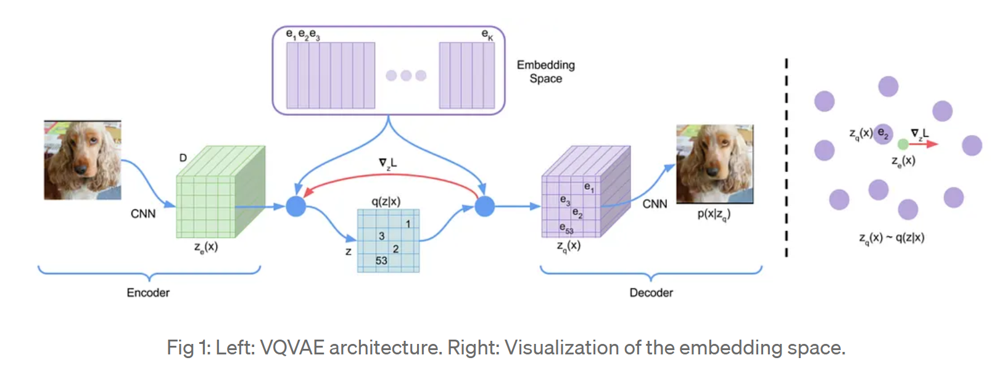

The VQ-VAE comprises three components:

- **Encoder** – Down samples the input MRI slices into latent representations through convolutional layers with BatchNorm, ReLU and residual stacks to preserve gradient flow.  
- **Vector Quantiser (VQ)** – Replaces each latent vector with its nearest codebook embedding, effectively discretising the latent space using a nearest-neighbour look-up.  
- **Decoder** – Transposed convolutions combined with residual blocks are used to reconstruct the original image from quantised embeddings.

Residual connections on all levels of the network provide stability of training and preserve fine structural details.

---

## Loss Function & Optimisation

The model co-optimises optimises three loss terms:

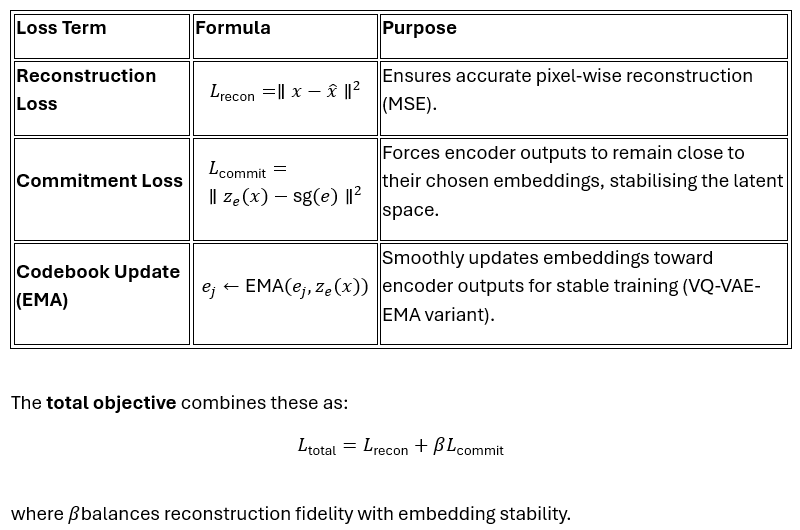

## Key Insight

Latent discretisation prevents “posterior collapse” which is a common issue in VAEs and thus results in a reliable, interpretable representation of MRI slices that captures both global anatomical structures and local variations which are essential for radiotherapy analysis.

---

## Environment & Setup

This repository includes a `requirements.txt` file to ensure reproducibility of the Python environment and dependencies.

### Option A: Using `venv`

python -m venv .venv

Activate (Windows)
.venv\Scripts\activate

Activate (Unix/MacOS)
source .venv/bin/activate

pip install --upgrade pip
pip install -r requirements.txt

### Option B: Using `conda`

conda create -n vqvae_env python=3.10 -y

conda activate vqvae_env

pip install -r requirements.txt

---

## Data Integrity & Overfitting Verification

To verify reliability, a diagnostic script (`sanity.py`) was used.

### Data Leakage Verification

- No filename or patient ID duplication.
- No duplicate slices or volumes in any of the splits.

### Overfitting Diagnostic

| Metric   | Train    | Validation | Gap      | Interpretation                |
|----------|----------|------------|----------|-------------------------------|
| SSIM     | 0.9365   | 0.9168     | +0.0197  | Minimal gap — no strong overfitting |
| MSE Loss | 0.0241   | 0.0375     | +0.0134  | Stable generalization          |

The validation and test SSIM(~0:935± 0:011) are close to each other, indicating strong generalisation and a good utilization of the codebook (perplexity ≈ 270).

---

**Distribution Plot:**  
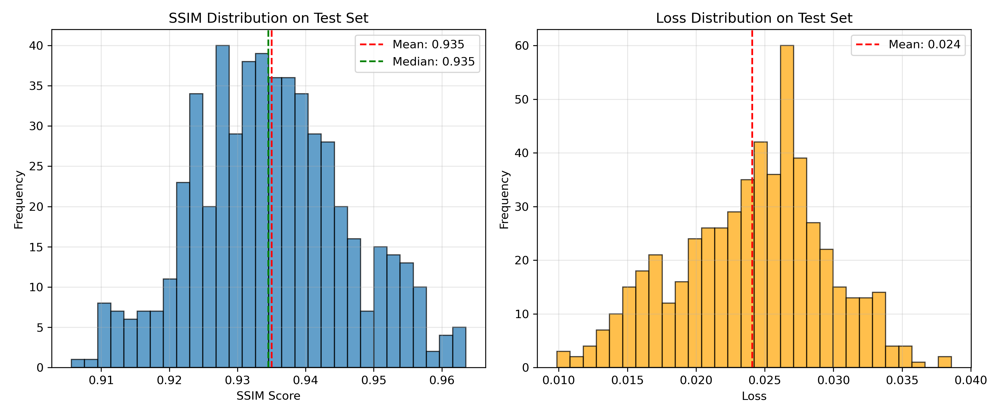  
Shows tightly clustered SSIM ≈ 0.935 (σ ≈ 0.011) and MSE ≈ 0.024, demonstrating uniform reconstruction quality.

**To rerun:**
python sanity.py --train_dir keras_slices_data/keras_slices_train --val_dir keras_slices_data/keras_slices_validate --test_dir keras_slices_data/keras_slices_test --config config.yaml

---

## Configuration Overview

This repository has a configuration system that it based on YAML (config. yaml) so that everything is fully reproducible between training and inference.

All the important hyperparameters, dataset paths and augmentation settings are defined in this single file and dynamically loaded by both `train.py` and `predict.py`.  
By modifying `config.yaml`, you can:
- Re-train the model with different architectures or learning settings.
- Adjust augmentation intensity and dataset directories.
- Run predictions from pre-trained checkpoints without editing the codebase.

### Configuration Parameters

All parameters are sourced from the configuration dictionary parsed from `config.yaml`. Model parameters are grouped under `model_parameters`, while the rest control training, data loading, and prediction.

#### Model Architecture Parameters (VQ-VAE)

These parameters define the structure of the VQ-VAE in `modules.py` and are specified under `model_parameters`.

| Parameter        | Description                                                  |
|------------------|--------------------------------------------------------------|
| `in_channels`    | Number of input channels (e.g., 1 for grayscale MRI slices). |
| `hidden_channels`| Depth of convolutional feature maps in encoder/decoder.     |
| `res_channels`   | Feature width within residual blocks.                        |
| `nb_res_layers`  | Number of residual blocks stacked in encoder/decoder.       |
| `embed_dim`      | Dimension of each embedding vector in the codebook.         |
| `nb_entries`     | Codebook size — total number of discrete embeddings.        |
| `downscale_factor`| Factor by which encoder reduces spatial dimensions (power of 2).|

#### Training Parameters (`train.py`)

These parameters control the optimisation process, data flow, and logging during training.

| Parameter      | Description                                                      |
|----------------|------------------------------------------------------------------|
| `batch_size`   | Number of samples per training iteration (used in both train/val). |
| `num_epochs`   | Total number of passes over the dataset.                         |
| `learning_rate`| Initial learning rate for the Adam optimiser.                    |
| `weight_decay` | L2 regularisation coefficient (default = 0).                    |
| `log_dir`      | Directory for logs, checkpoints, and visualisations.            |

Logging Behaviour (hard-coded):
- Example reconstructions saved every 5 epochs → `logs/images/epoch_X.png`.
- Training metrics auto-saved → `metrics.json` and `training_curves.png`.
- Best model saved as `logs/best_model.pth` (lowest validation loss).

#### Dataset & Data Loading Parameters

Handled by `dataset.py` and `train.py`, these parameters manage dataset locations, sampling, and augmentation pipelines.

| Parameter          | Description                                        |
|--------------------|----------------------------------------------------|
| `train_dataset_dir`| Directory with training `.nii` slices.            |
| `val_dataset_dir`  | Directory with validation `.nii` slices.          |
| `test_dataset_dir` | Directory with test `.nii` slices (evaluation).   |
| `train_num_samples`/`val_num_samples`/`test_num_samples` | Optionally limit loaded samples per split.|
| `train_transforms` | Data augmentations: `RandomHorizontalFlip`, `RandomVerticalFlip`, `RandomRotation`, `RandomAffine`, `GaussianNoise`. |
| `val_test_transforms` | Augmentations for validation/test data (usually empty). |
| `norm_image`       | Flag to apply z-score normalisation per slice.     |

#### Prediction Parameters (`predict.py`)

This controls how the trained model is loaded and used for inference

| Parameter         | Description                                   |
|-------------------|-----------------------------------------------|
| `pretrained_path` | Path to model checkpoint (e.g., `logs/best_model.pth`). |
| `save_dir`        | Output directory for reconstructed images and plots. |
| `test_dataset_dir`| Directory containing test slices for inference. |
| `val_test_transforms` | Optional augmentations for inference (usually empty). |

---

## Code Structure

The project is designed with modularity to enhance clarity, maintainability, and reproducibility across various components:

- `modules.py`: Implements full VQ-VAE architecture, including ResidualBlock, ResidualStack (for stable deep feature extraction), VectorQuantizer (discrete codebook lookups and loss computation), and the unified VQVAE class that connects encoder, quantizer, decoder pipeline as an end-to-end model.

- `dataset.py`: Data loader and preprocessor for 2D MRI slices in NIfTI files. It defines HipMRIDataset to standardize slices and get_dataloader() to create PyTorch loaders for training, validation and testing with option for data augmentation based on config.yaml.

- `train.py`: Defines the training loop which includes initializing the model, optimizer and data loaders, perfoming forward and backward passes, calculation of reconstruction, commitment and quantization losses over multiple epochs. Tracks SSIM and perplexity, save best checkpoint (logs/best_model. pth), and generates training curves.

- `predict.py`: Handles inference with a pre-trained checkpoint, loads reconstructed MRI slices and calculates SSIM and MSE as well as saving the reconstructed images, comparison grids and distribution plots (ssim_loss_distribution. png) to a predictions/ directory.

- `utils.py`: It provides shared utilities for YAML parsing, NIfTI loading, SSIM calculation, visualization, and augmentation construction which includes custom transforms such as Gaussian noise.

- `config.yaml`: Central configuration file specifying all parameters - model architecture, hyperparameters, dataset paths and augmentations—making entire experiment reproducible without modifying code.

---

## Hyperparameter Tuning Summary

### Learning Rate Study

| LR     | Train Loss | Val Loss | Train SSIM | Val SSIM | Observation        |
|--------|------------|----------|------------|----------|--------------------|
| 0.0001 | 0.0817     | 0.0753   | 0.642      | 0.646    | Too slow           |
| 0.0005 | 0.0073     | 0.0090   | 0.890      | 0.896    | Minor instability  |
| **0.001**  | **0.0061**     | **0.0053**   | **0.906**      | **0.917**    | **Best balance**       |
| 0.005  | 0.0052     | 0.0048   | 0.907      | 0.912    | Oscillatory        |

### Hyperparameter Sensitivity (Validation Set)

| Config | Hidden Ch. | Embed Dim | Codebook Size | Val SSIM | Val Loss | Perplexity      | Observation     |
|--------|------------|-----------|---------------|----------|----------|-----------------|-----------------|
| A      | 64         | 32        | 256           | 0.865    | 0.038    | 220 ± 25        | Underfitting    |
| **B**      | **128**        | **64**        | **512**           | **0.917**    | **0.029**    | **275 ± 18**        | **Best balance**    |
| C      | 256        | 128       | 512           | 0.923    | 0.028    | 320 ± 22        | Heavier model   |
| D      | 128        | 64        | 1024          | 0.910    | 0.031    | 190 ± 35        | Partial collapse|

### Augmentation Effect

| Setting           | Val SSIM | Observation        |
|-------------------|----------|--------------------|
| Without Augmentation | 0.937    | Slight overfitting  |
| **With Augmentation**  | **0.959**    | **Better generalization**|

### Downscale Factor

| Factor | Val SSIM | Observation         |
|--------|----------|---------------------|
| **4**      | **0.917**    | **Optimal balance**      |
| 8      | 0.832    | Detail loss         |
| 16     | 0.595    | Severe degradation   |

### Optimizer Comparison

| Optimizer | LR    | SSIM | Observation     |
|-----------|-------|------|-----------------|
| **Adam**      | **0.001** | **0.917**| **Stable, smooth**  |
| SGD       | 0.001 | 0.523| Noisy codebook  |

---

## Results & Discussion

• Training and validation curves converged well without overfitting (SSIM gap < 0.02).  
• The final model's acheivements are as follows:  
  - **Mean SSIM:** 0.935 ± 0.011  
  - **Mean Reconstruction Loss:** 0.024  
  - **Codebook Perplexity:** ≈ 270–300  
• The reconstructions not only preserved the sharp tissue boundaries but it also maintained the consistency and coherence of the anatomical structures.  
• Data augmentation improved generalization as well as robustness to scanner variations.  

---

### Training Progress

The model demonstrated stable convergence across loss, SSIM, and codebook utilization:

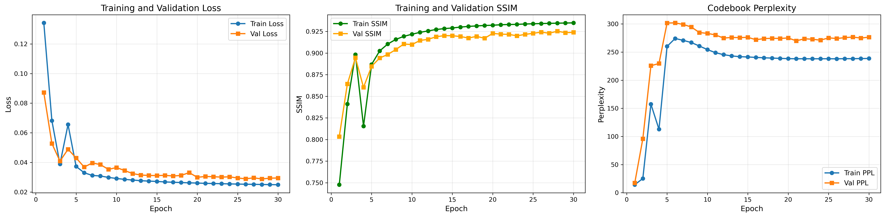

---

### Reconstruction Quality Across Epochs

As the training progressed, reconstruction fidelity also improved .:

| Epoch 5 | Epoch 10 | Epoch 15 |
|----------|-----------|-----------|
| 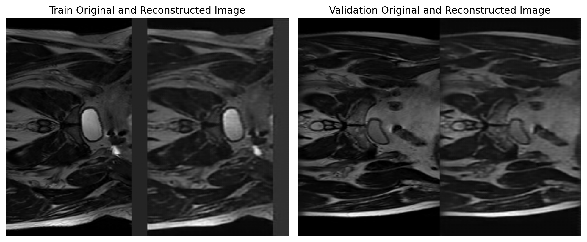 | 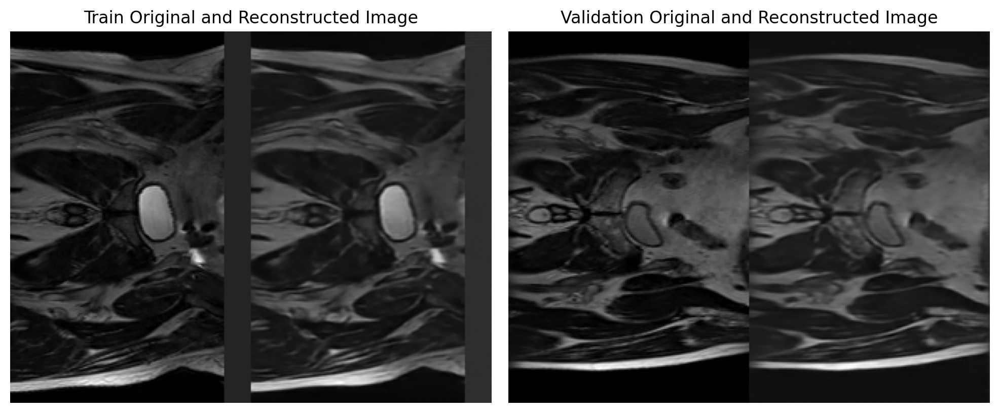 | 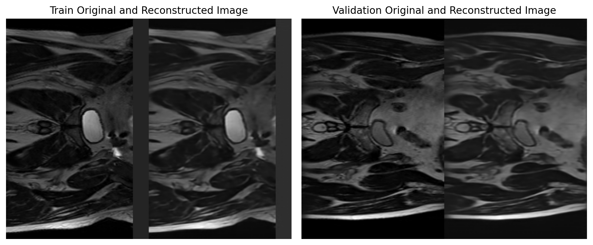 |

| Epoch 20 | Epoch 25 | Epoch 30 |
|-----------|-----------|-----------|
| 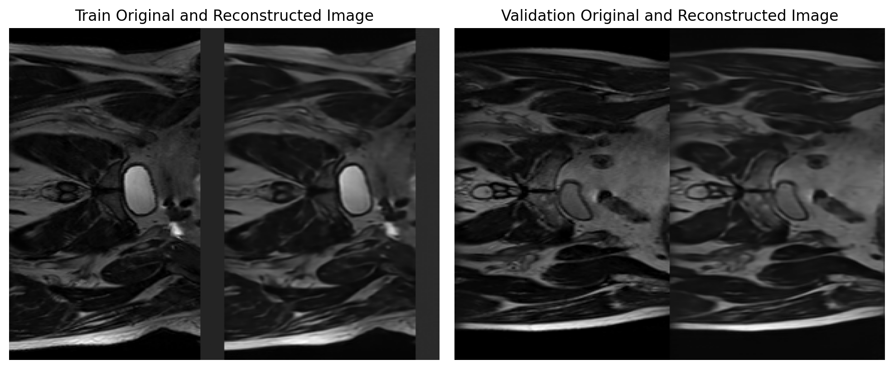 | 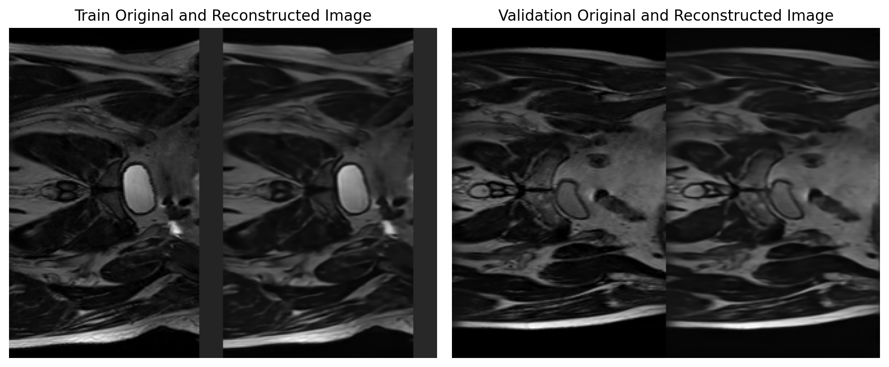 |  |

---

## Sanity Check & Console Outputs

Further evaluations were performed via the console in order to ensure the proper learning stability with no data leakage and overfitting.

### Training Phase Logs

The VQ-VAE model training ran smoothly for 30 epochs and the observation was - loss, SSIM, and codebook perplexity were converged as expected.

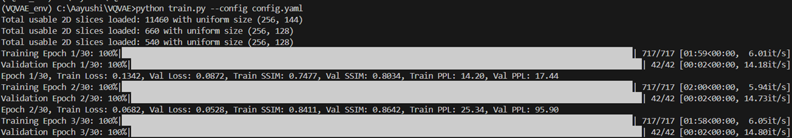
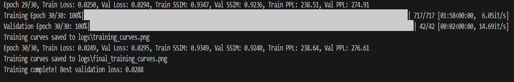

---

### Test Phase Results

The model was tested on 540 test slices and the achieved results are having strong structural similarity (SSIM) with low reconstruction loss .

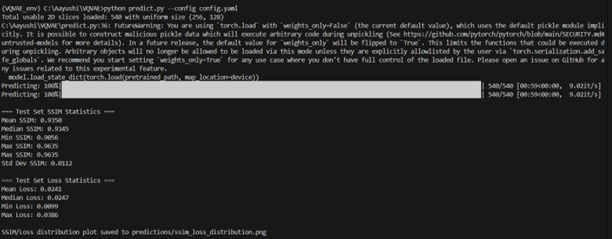
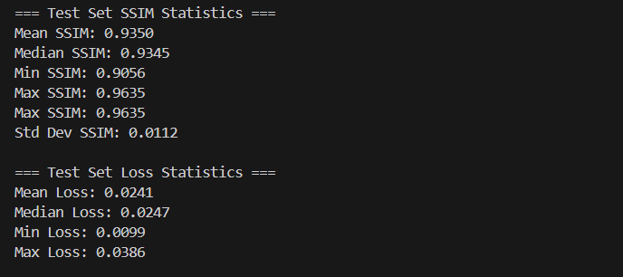

---

### Sanity Check: Overfitting & Data Leakage Validation

For assessing the generalization performance a lightweight diagnostic script which is `(sanity.py)` was ran. It has evaluated small batches from the train and validation splits on SSIM vs. Loss and Level of Loss.

**Observation:**  
The SSIM gap between the training and validation was **approximately +0.0197**, which clearly doesn’t suggests any overfitting possibilities.

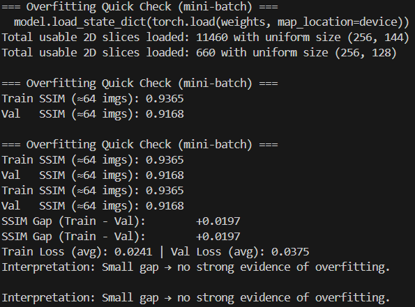

---

## Model Behavior Insights

The reconstructed MRI slices displays slight smoothness which is due to the Mean Squared Error (MSE) objective which penalizes pixel-level deviations and also causes decoder to predict averaged intensities. When in conjunction with vector quantization and transposed convolutions, this results in the smoothing of high-frequency edges during the decodig process while preserving globally consistent anatomy. This is a desirable attribute in medical imaging since the integrity of structures and their relationship to one another is more important than the precision of individual pixels.

The slightly higher validation SSIM relative to the training SSIM is not a sign of overfitting. This is a result of the stochastic augmentations (flips, affine shifts, Gaussian noise) applied only during training, which makes the reconstruction task more difficult. Because the validation data is unaugmented, this is why the validation SSIM score is higher. The small gap of ~0.02 indicates strong generalization and stable learning.

---

## Future Work

- Hierarchical / Multi-Level VQ-VAE to manage more complex latent hierarchies
- 3D or Temporal Extensions ascribed with volumetric consistency
- Adaptive Codebook with Entropy Regularization
- Hybrid Perceptual Losses geared towards for depth smoothness reduction

---

## Conclusion

This reconstruction of HipMRI with VQ-VAE yielded remarkable and reproducible outcomes which is **SSIM about 0.935 ± 0.011, Loss 0.024, and Perplexity 280** by demonstrating clear generalization and no overfitting.
With meticulous hyperparameter tuning and augmentation, the model preserved structural integrity while achieving the high computational efficiency.
It establishes a robust foundation for discrete representation learning in medical imaging thereby paving the way for perceptually enhanced and clinically interpretable reconstruction frameworks.

## References

1. van den Oord, A., Vinyals, O., & Kavukcuoglu, K. (2017). *Neural discrete representation learning*. Advances in Neural Information Processing Systems (NeurIPS). [https://arxiv.org/abs/1711.00937](https://arxiv.org/abs/1711.00937)

2. Kingma, D. P., & Welling, M. (2014). *Auto-Encoding Variational Bayes*. arXiv preprint arXiv:1312.6114. [https://arxiv.org/abs/1312.6114](https://arxiv.org/abs/1312.6114)

3. Dosovitskiy, A., Beyer, L., Kolesnikov, A., Weissenborn, D., Zhai, X., Unterthiner, T., ... & Houlsby, N. (2020). *An Image is Worth 16x16 Words: Transformers for Image Recognition at Scale*. arXiv preprint arXiv:2010.11929. [https://arxiv.org/abs/2010.11929](https://arxiv.org/abs/2010.11929)

4. Wang, Z., Bovik, A. C., Sheikh, H. R., & Simoncelli, E. P. (2004). *Image quality assessment: From error visibility to structural similarity*. IEEE Transactions on Image Processing, 13(4), 600–612. [https://ieeexplore.ieee.org/document/1284395](https://ieeexplore.ieee.org/document/1284395)
